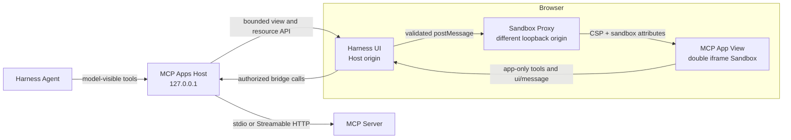

# DSH MCP Apps

English | [简体中文](README.zh-CN.md)

[](https://github.com/creativedswork/dsh-mcp-apps/actions/workflows/ci.yml)
[](https://www.npmjs.com/package/@deepseek-ai/dsh-mcp-apps)
[](https://github.com/creativedswork/dsh-mcp-apps/releases)
[](LICENSE)

Cordis plugin bundle for hosting stable-spec MCP Apps in the DeepSeek Harness Web UI. One npm package provides the Host plugin, Browser bundle, and `dsh.bundle` patch needed to activate both.

The Host owns its MCP connections, exposes model-visible tools through Harness, keeps app-only tools out of the model registry, and serves untrusted Views through a different-origin Sandbox Proxy. No agent-loop change or external MCP proxy is required.


The 34-second flow uses [`threejs-editor-mcp`](https://github.com/creativedswork/threejs-editor-mcp): the user changes the Canvas layout and camera, clicks **Save**, the App sends a standard `ui/message`, and the Agent calls `inspect_project` before responding to the saved operations.

## Install

Install the package into the Web profile:

```sh
dsh plugin --profile web add @deepseek-ai/dsh-mcp-apps
```

The bundle is activated automatically. Configure its `mcp-apps` row in `$DSH_HOME/profiles/web/cordis.patch.yml`:

```yaml
- id: mcp-apps
  config:
    servers:
      - serverName: counter
        transport: stdio
        command: node
        args: [/absolute/path/to/server.js]
        cwd: /absolute/path/to/server
```

`transport: streamable-http` accepts `url` and optional `headers` instead of `command`, `args`, `cwd`, and `env`. `serverName` must match `[A-Za-z0-9_-]{1,32}` and becomes part of the public tool name.

Start Harness with:

```sh
dsh web
```

The Web profile must bind to `127.0.0.1`; the plugin rejects broader bindings because the Sandbox Proxy currently supports loopback browsers only.

## Standalone Counter Demo

The checkout includes a local stdio MCP server with:

- `show_counter`, a model-visible tool linked to `ui://counter/app`;
- `increment_counter`, an app-only tool available only to that View;
- a bundled View using the official MCP Apps `App`.

Run the demo from this checkout with the published Harness CLI. It does not require a neighboring `deepseek-harness` source directory:

```sh
pnpm install
pnpm run build
export DSH_HOME="$PWD/.tmp/demo-home"
pnpm dlx @deepseek-ai/dsh@0.1.0-rc.6 plugin --profile web add "$PWD"
pnpm dlx @deepseek-ai/dsh@0.1.0-rc.6 web --patch "$PWD/demo/cordis.patch.yml"
```

Open the printed URL, connect this directory as the workspace, and ask the configured model to show the counter. The settled tool row renders a counter at `0`; the `+` button calls app-only `increment_counter` through the Host and updates the View to `1`.

For the full editor example, install and configure [`threejs-editor-mcp`](https://github.com/creativedswork/threejs-editor-mcp).

## Behavior

- Targets MCP Apps specification `2026-01-26` and advertises `text/html;profile=mcp-app`.
- Supports stdio and Streamable HTTP MCP transports.
- Applies `_meta.ui.visibility`; omitted visibility means model and app.
- Persists readable text for the model while retaining `structuredContent` and result `_meta` in bounded UI-only presentation metadata.
- Uses the official `AppBridge` and `PostMessageTransport` for View lifecycle and app-originated tool/resource calls.
- Mediates `ui/download-file` for one embedded JSON resource up to 4 MiB because Sandbox Views cannot download directly.
- Enforces CSP by HTTP header on a separate loopback origin and validates `postMessage` source and origin.
- Falls back to the ordinary text tool result when a View cannot load.

Tool-list changes are synchronized, while automatic transport reconnection is not yet implemented. The Browser refreshes its catalog every five seconds.

## Security Architecture



- The Host and Sandbox Proxy use different loopback origins.
- The View runs inside a double iframe with HTTP CSP and explicit sandbox attributes.
- `postMessage` source and origin are validated before bridge traffic is accepted.
- Tool visibility separates model-visible tools from app-only tools.
- Host APIs reject cross-origin writes and enforce finite body and metadata limits.

## Development

```sh
pnpm install
pnpm run check
pnpm run pack:dry-run
```

Install a local checkout into a profile:

```sh
dsh plugin --profile web add .
dsh --profile web --dump-config
```

## Publishing

`prepack` runs type checking, the production build, and package tests. The npm tarball contains the Host entry, Browser bundle, declarations, bundle patch, license, and both README languages; development Demo files are excluded.

Publishing is manual through the [Publish workflow](https://github.com/creativedswork/dsh-mcp-apps/actions/workflows/publish.yml). The `npm` environment must provide an `NPM_TOKEN` with permission for the `@deepseek-ai` scope. The workflow publishes with provenance and creates `v0.1.0` plus the GitHub Release only after npm succeeds.
