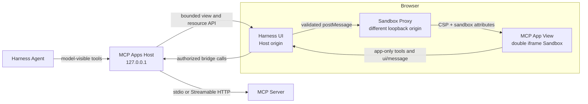

# DSH Uni Editor

English | [简体中文](README.zh-CN.md)

[](https://github.com/creativedswork/dsh-uni-editor/actions/workflows/ci.yml)
[](https://www.npmjs.com/package/@creative-dswork/dsh-uni-editor)
[](https://github.com/creativedswork/dsh-uni-editor/releases)
[](LICENSE)

**All Editors, one DSH Editor.**

DSH Uni Editor brings existing Editors into DeepSeek Harness Agent Chat. Editors keep their own UI, data model, and domain tools; DSH provides one entry point, the current Session context, and a verifiable handoff between human edits and the Agent.

The runtime is a Cordis plugin bundle powered by stable-spec MCP Apps. One npm package provides the Host plugin, Browser bundle, and `dsh.bundle` patch needed to activate both.

The Host owns its MCP connections, exposes model-visible tools through Harness, keeps app-only tools out of the model registry, and serves untrusted Views through a different-origin Sandbox Proxy. No agent-loop change or external MCP proxy is required.

<a href="https://www.youtube.com/watch?v=KkvLgN2GeTI">
  
</a>

[Watch the video demo](https://www.youtube.com/watch?v=KkvLgN2GeTI) to see [`threejs-editor-mcp`](https://github.com/creativedswork/threejs-editor-mcp) running directly inside DSH Chat UI. The Editor stays reachable from the Session Header, can move between inline and fullscreen without recreating its iframe, and can return to its originating tool message with **Locate in Chat**.

## Install

Install the package into the Web profile:

```sh
dsh plugin --profile web add @creative-dswork/dsh-uni-editor
```

The bundle is activated automatically. Configure its `mcp-apps` row in `$DSH_HOME/profiles/web/cordis.patch.yml`:

```yaml
- id: mcp-apps
  config:
    servers:
      - serverName: counter
        transport: stdio
        command: node
        args: [/absolute/path/to/server.js]
        cwd: /absolute/path/to/server
        forwardWorkspace: true
```

`forwardWorkspace` is disabled by default. Enable it only for a trusted local
stdio Server that needs the calling DSH Workspace. `transport:
streamable-http` never receives Workspace metadata and accepts `url` and
optional `headers` instead of `command`, `args`, `cwd`, and `env`.
`serverName` must match `[A-Za-z0-9_-]{1,32}` and becomes part of the public
tool name.

Start Harness with:

```sh
dsh web
```

The Web profile must bind to `127.0.0.1`; the plugin rejects broader bindings because the Sandbox Proxy currently supports loopback browsers only.

## Standalone Counter Demo

The checkout includes a local stdio MCP server with:

- `show_counter`, a model-visible tool linked to `ui://counter/app`;
- `increment_counter`, an app-only tool available only to that View;
- a bundled View using the official MCP Apps `App`.

Run the demo from this checkout with the published Harness CLI. It does not require a neighboring `deepseek-harness` source directory:

```sh
pnpm install
pnpm run build
export DSH_HOME="$PWD/.tmp/demo-home"
pnpm dlx @deepseek-ai/dsh@0.1.0-rc.6 plugin --profile web add "$PWD"
pnpm dlx @deepseek-ai/dsh@0.1.0-rc.6 web --patch "$PWD/demo/cordis.patch.yml"
```

Open the printed URL, connect this directory as the workspace, and ask the configured model to show the counter. The settled tool row renders a counter at `0`; the `+` button calls app-only `increment_counter` through the Host and updates the View to `1`.

For the full editor example, install and configure [`threejs-editor-mcp`](https://github.com/creativedswork/threejs-editor-mcp).

## Behavior

- Targets MCP Apps specification `2026-01-26` and advertises `text/html;profile=mcp-app`.
- Supports stdio and Streamable HTTP MCP transports.
- Applies `_meta.ui.visibility`; omitted visibility means model and app.
- For trusted local stdio Servers with `forwardWorkspace: true`, adds the
  calling Agent's immutable workspace `cwd` to model-originated `tools/call`
  request metadata at `ai.deepseek.dsh/workspace`. It is never added to remote
  HTTP or app-originated calls, model-visible tool arguments, or results.
- Persists readable text for the model while retaining `structuredContent` and result `_meta` in bounded UI-only presentation metadata.
- Uses the official `AppBridge` and `PostMessageTransport` for View lifecycle and app-originated tool/resource calls.
- Keeps a Session-scoped Active App entry in the Header, with support for multiple MCP App instances.
- Opens the active App fullscreen without recreating its iframe or `AppBridge`, preserving unsaved View state.
- Returns to the originating tool message with `Locate in Chat`.
- Mediates `ui/download-file` for one embedded JSON resource up to 4 MiB because Sandbox Views cannot download directly.
- Enforces CSP by HTTP header on a separate loopback origin and validates `postMessage` source and origin.
- Falls back to the ordinary text tool result when a View cannot load.

Tool-list changes are synchronized, while automatic transport reconnection is not yet implemented. The Browser refreshes its catalog every five seconds.

## Security Architecture



- The Host and Sandbox Proxy use different loopback origins.
- The View runs inside a double iframe with HTTP CSP and explicit sandbox attributes.
- `postMessage` source and origin are validated before bridge traffic is accepted.
- Tool visibility separates model-visible tools from app-only tools.
- Host APIs reject cross-origin writes and enforce finite body and metadata limits.

## Development

```sh
pnpm install
pnpm run check
pnpm run pack:dry-run
```

Install a local checkout into a profile:

```sh
dsh plugin --profile web add .
dsh --profile web --dump-config
```

## Publishing

`prepack` runs type checking, the production build, and package tests. The npm tarball contains the Host entry, Browser bundle, declarations, bundle patch, license, and both README languages; development Demo files are excluded.

Publishing is manual through the [Publish workflow](https://github.com/creativedswork/dsh-uni-editor/actions/workflows/publish.yml). The `npm` environment must provide an `NPM_TOKEN` with permission for the `@creative-dswork` scope. The workflow publishes with provenance and creates the matching version tag and GitHub Release only after npm succeeds.

Versions through `0.2.0` were published as `@creative-dswork/dsh-mcp-apps`. Install `@creative-dswork/dsh-uni-editor` for current releases.
