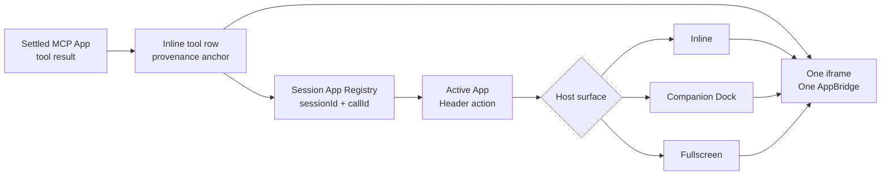
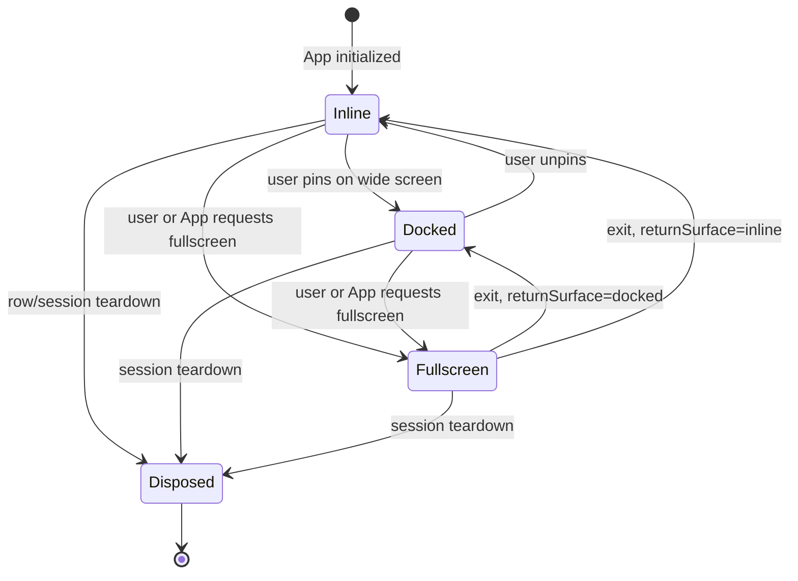

# Persistent MCP App Access and Dock Proposal

状态：**Phase A 已实现并验收，随 `0.2.0` 交付；Companion Dock 暂缓**
日期：2026-08-19
目标版本：`dsh-mcp-apps` 后续版本
关联场景：Three.js Editor 等长时间交互式 MCP App

## 目标

用户在 DSH Chat 中打开 MCP App 后，即使后续消息把原始工具卡片推到视野外，
仍能从当前 Session 的固定入口返回同一个 App。桌面端可以把 App 固定在 Chat
旁边继续协作，移动端可以快速进入 fullscreen。

用户可感知的结果：

- 原始工具卡片继续留在消息流中，记录 App 的来源和工具结果；
- Session Header 始终提供 `Active App` 入口；
- 用户主动选择 `Dock` 后，Chat 滚动不再影响 App 可见性；
- `Inline -> Dock -> Fullscreen -> Dock` 复用同一个 iframe 和 AppBridge；
- 固定、展开、定位和关闭 View 都不调用 MCP tool，不创建 Agent turn；
- 一个 Session 的 App 不会出现在另一个 Session 中。

本提案只解决同一 Session 内的可达性和展示位置，不承诺：

- 页面刷新后恢复 App 内尚未保存的内存状态；
- 切换到其他 Session 后继续保活当前 iframe；
- 修改 MCP Apps 规范定义的 display mode；
- 让 App 获得新的工具、文件或网络权限。

## 当前行为与缺口

当前 Browser 插件在
[`src/client/index.tsx`](../src/client/index.tsx) 的 `McpAppRow` 中创建 iframe 和
AppBridge。

| 当前事实 | 能证明 | 不能证明 / 直接影响 |
|---|---|---|
| MCP App View 由 `tool.call.toolview` 消息行渲染 | App 与产生它的工具结果保持关联 | 历史消息滚出视野后没有固定返回入口 |
| Host 支持标准 `inline` 和 `fullscreen` | App 可以请求全屏，并在同一 iframe 中切换 | 用户必须先找到原卡片才能点击全屏 |
| Fullscreen 通过同一行内 wrapper 的 `position: fixed` 实现 | 切换全屏不需要新建 AppBridge | 退出后仍回到原始滚动位置 |
| Harness 提供 `conversation.session.header.actions` | 插件可增加 Session 级按钮而不替换 Header | 当前 `dsh-mcp-apps` 尚未注册该入口 |
| Harness 的 `details` 列已由 Conversation Details 占用 | 工具详情具备独立右栏 | `dsh-mcp-apps` 不能覆盖它来实现通用 App Dock |
| Harness 提供 `shell.overlay` | 可增加 frame-wide 浮层 | 浮层会覆盖布局，不能等价于真正的并排 Dock |

因此，`sticky` 工具卡片或覆盖式浮层只能改善表象，不能同时满足 Chat 可用空间、
App 状态连续性和插件间布局兼容。

## 术语

### App Instance

一次已完成的、带 MCP App presentation metadata 的工具调用，在当前 Session UI
挂载期间对应一个 App Instance：

```text
settled tool result
  -> load MCP App resource
  -> create Sandbox iframe and AppBridge
  -> user interacts
  -> row/session teardown
```

App Instance 的身份应使用 `sessionId + callId`。`viewId` 标识可加载的 MCP App
View 和 Host 授权绑定，不足以区分同一个工具的多次调用。

### Active App

当前 Session 中用户最近激活的 App Instance。一个 Session 可以记录多个 App
Instance，但同一时刻只展示一个 Dock 或 fullscreen surface。

### Host Surface

Host 决定 App 在 DSH 中出现的位置：

- `inline`：原始工具消息内；
- `docked`：桌面端 Chat 旁边的 companion panel；
- `fullscreen`：覆盖整个 DSH viewport。

`docked` 是 DSH Host 的布局状态，不是新的 MCP Apps display mode。App 在
`inline` 和 `docked` 时都接收规范中的 `displayMode: "inline"`，同时收到实际
container dimensions；只有 fullscreen 映射为 `displayMode: "fullscreen"`。

## 方案比较

| 方案 | 优势 | 代价 | 结论 |
|---|---|---|---|
| 工具卡片 `position: sticky` | 改动小 | 大 View 遮挡消息；多个 App 相互竞争；受消息父容器限制 | 不采用 |
| 固定“定位到原消息”按钮 | 可以快速返回；无布局改动 | 返回后 App 仍会再次滚走；不能边看 App 边聊天 | 仅作为辅助动作 |
| 新增 `conversation.view` App Tab | 使用现有 Tab 体系；不会覆盖 Chat | Chat 与 App 不能同时可见；切换 Tab 可能卸载 View | 不作为主方案 |
| 使用现有 `details` 列 | 已有可调整宽度的右栏 | 需要替换整个 DetailsPanel，破坏所有工具详情 | 不采用 |
| Session Header + 通用 companion Dock | 入口稳定；桌面可并排；移动端可降级；职责属于 Host | 需要 Harness 提供一个可追加的布局 seat | **推荐** |

## 推荐交互

### 默认行为

1. 工具完成后，MCP App 仍按当前行为在 Chat 中 inline 渲染。
2. Session Header 出现 `Active App` 按钮。
3. App 滚出视野时不自动弹出，也不自动进入 Dock。
4. 用户点击 Header 按钮：
   - 当前阶段在宽屏和窄屏均进入 fullscreen；
   - Future Companion Dock 交付后，宽屏才改为打开 Dock。
5. Header 菜单同时提供：
   - `Open Fullscreen`；
   - `Locate in Chat`；
   - 当前 Session 有多个 App 时的 App 列表。
   - Future Companion Dock 可用后再增加 `Open in Dock`。

不自动 Dock 是硬性产品选择：阅读历史消息不应导致一个大型交互界面突然占用
布局。是否保持可见由用户明确控制。

### Dock 行为

- Dock 出现在 Conversation 右侧，不能覆盖 Chat、Composer 或 Session Header；
- 宽度可调整，并参与 Harness 的窄屏 concession；
- App 原始消息位置保留等高 placeholder，防止聊天滚动位置跳变；
- 关闭 Dock 默认回到 inline，不关闭 MCP Server；
- `Locate in Chat` 退出 Dock 后把原工具消息滚入视野；
- App 请求 fullscreen 时记录 `returnSurface=docked`，退出 fullscreen 后返回
  Dock，而不是强制回到 inline。

### 移动端

- 不显示并排 Dock；
- Header 显示紧凑 App 图标和可访问名称；
- 点击直接进入 fullscreen；
- 退出 fullscreen 后返回 Chat 当前滚动位置；
- 不使用覆盖 Composer 的 bottom sheet。

## 目标链路

这张图回答“App 工具结果、固定入口和同一 iframe 如何协作”。



Header action 只控制 presentation；MCP Server、tool registry 和 Agent Loop 不参与
surface transition。

## Surface 状态机



Chat 滚动不会触发状态转换。页面刷新和 Session 切换沿用当前 teardown 行为。

## 技术方案

### 1. Session App Registry

在 `dsh-mcp-apps` Browser bundle 中增加 Session 级 registry：

```ts
interface AppInstanceController {
  sessionId: string
  callId: string
  publicToolName: string
  surface: 'inline' | 'docked' | 'fullscreen'
  ready: boolean
  activate(): void
  locate(): void
  requestSurface(surface: 'inline' | 'docked' | 'fullscreen'): void
}
```

Registry 负责：

- 按 `sessionId + callId` 注册和注销 App Instance；
- 记录每个 Session 的 active call；
- 向 Header action 发布只读快照；
- 将 Header 操作路由到正确的 `McpAppRow` controller；
- 保证跨 Session 操作无法命中其他 Session 的 iframe。

Registry 不保存工具权限、Workspace path 或 App 内部状态。

### 2. 保持 iframe 所有权

首版继续由 `McpAppRow` 创建并拥有 iframe/AppBridge。进入 Dock 或 fullscreen 时
只改变其 wrapper 的 Host surface，不创建第二个 iframe，也不重新读取工具结果。

Companion panel 负责提供预留空间、边框和实时 geometry；原消息行保留等高
placeholder，iframe wrapper 根据该 geometry 切换为固定定位。禁止把 iframe
Portal 到另一个 React owner、用第二个 iframe 镜像，或通过卸载后重建来模拟
Dock，这些方式都会破坏 App 内临时状态或产生第二次初始化。

必须保持以下不变量：

```text
iframe identity before transition === iframe identity after transition
AppBridge identity before transition === AppBridge identity after transition
```

这保证 App 内未保存的 transform、选中对象和临时参数不会因为展示位置变化而
丢失。

首版依赖当前 Chat 行在同一 Session 长滚动期间保持 mounted。验收必须用长历史
验证这一事实；若 Harness 后续引入 Chat virtualization，布局契约需要允许 pinned
App row 保活，不能静默卸载 iframe。

### 3. Header 入口

`dsh-mcp-apps` 注册：

```text
conversation.session.header.actions
  id: mcp-apps-active
  scope: session
```

入口只在当前 Session 存在可用 App Instance 时出现。一个 App 显示图标按钮；
多个 App 显示数量并打开菜单。名称首版来自 `publicToolName`，后续可在 Host
验证后使用 MCP App presentation metadata。

### 4. Harness companion panel

真正的并排 Dock 需要 `deepseek-harness` 的 `ui-layout` 提供一个新的 additive
layout seat，例如：

```text
conversation.companion
```

布局职责属于 Harness：

- 为 companion panel 预留 grid track；
- 提供 open/close/resize action；
- 与 sidebar、details、center minimum width 一起计算 concession；
- 窄屏时把 companion 宽度解析为 0；
- 保持现有 `details` 工具详情列不变。

`dsh-mcp-apps` 负责注册 Dock chrome 和当前 App surface。它不能替换
`conversation`、`details` 或整个 `root` slot。

当前实施先交付 Header 入口：

```text
Header button
  -> wide/narrow 均打开同一 iframe fullscreen
  -> Locate in Chat
```

这一步解决“原卡片找不到”的问题，不依赖 Harness 源码修改，也不能称为
Dock。

### 5. Host context

Surface 变化后，Host 更新 AppBridge context：

| Host surface | MCP `displayMode` | `containerDimensions` |
|---|---|---|
| inline | `inline` | 原消息行实际宽度和 `maxHeight` |
| docked | `inline` | companion panel 实际 width/height |
| fullscreen | `fullscreen` | viewport width/height |

Dock resize 必须去抖后发送新的 Host context。App 的 `ui/size-change` 只控制
inline 高度，不得反向改变 Dock grid track。

### 6. 多 App

- 每个 settled tool call 对应一个 App Instance；
- 最近交互的 Instance 成为 Active App；
- 同时只允许一个 Docked 或 Fullscreen Instance；
- 切换 Active App 时，当前 Instance 先回到 inline，再激活目标 Instance；
- Header 菜单提供 `Locate`，防止用户无法判断 App 来源；
- 不自动销毁非 Active 的 inline Instance，沿用当前工具行生命周期。

## 安全与 Agent Loop

Dock 不增加新的权限边界：

- iframe 继续运行在不同 origin 的双层 Sandbox；
- App tool/resource 请求继续携带原 `viewId`，经过现有 Host API；
- `forwardWorkspace` 行为不变；
- Header 和 Dock action 不接受模型输入；
- surface transition 不产生 Session prompt、tool call 或新的 durable message；
- 切换 Session 时 registry 必须按 `sessionId` 隔离控制器；
- teardown 继续调用 `teardownResource` 并关闭 AppBridge。

## 代码影响

### `dsh-mcp-apps`

| 文件/模块 | 修改 |
|---|---|
| `src/client/index.tsx` | 拆分 App runtime、row presentation 和 surface controller |
| `src/client/app-registry.ts` | 新增 Session App Registry |
| `src/client/active-app-action.tsx` | 新增 Header action 和多 App 菜单 |
| `src/client/app-surface.tsx` | 统一 inline/docked/fullscreen 状态转换 |
| Browser inject | 增加所需 slot/layout 类型依赖 |
| tests | 增加长 Chat、surface identity、Session 隔离和移动端 E2E |

Host 的 MCP transport、tool registration 和 Sandbox Proxy 无需因 Dock 改变。

### `deepseek-harness`

若交付真正 Dock，需要最小通用增强：

| 模块 | 修改 |
|---|---|
| `client-ui-layout` | 新增 additive companion panel seat 和 grid track |
| layout service/store | 新增 companion open/close/resize |
| concession solver | details 和 companion 按明确优先级收缩/关闭 |
| slot catalog | 记录新 seat 的 scope、owner props 和替换风险 |
| Browser E2E | 验证 Chat、Composer、details 和 companion 不重叠 |

该增强必须保持领域无关，不能出现 Three.js、Editor 或 MCP 专用命名。

### MCP App 项目

`threejs-editor-mcp` 等 App 不需要修改。它们继续只使用标准：

```text
availableDisplayModes: ["inline", "fullscreen"]
requestDisplayMode({ mode })
Host context containerDimensions
```

## 分阶段实施

### Phase A：Persistent Return Entry

只修改 `dsh-mcp-apps`：

- Session App Registry；
- `Active App` Header action；
- `Open Fullscreen`；
- `Locate in Chat`；
- 多 App 菜单；
- Session 隔离、基础 teardown 和插件卸载清理；
- inline/fullscreen 同 iframe identity；
- 长 Chat 和 Session 隔离测试。

该阶段解决“卡片滚出视野后无法返回”，但不宣称支持 Dock。

实施结果：

- Registry 按 `sessionId + callId` 隔离并支持多个 App Instance；
- Header 提供 Active App、Open Fullscreen、Locate 和多 App 菜单；
- fullscreen 保留原消息等高占位和 Chat scroll position；
- 插件和工具行 teardown 会注销 controller、iframe 和 AppBridge；
- Registry 单元测试、构建、包门禁和真实 Three.js Editor 浏览器路径已通过。

真实 Editor 路径验证结果：

```text
outer iframe identity: true
inner iframe identity: true
dirty state: dirty -> dirty -> dirty
Key Light position X: -2.375 -> -2.375 -> -2.375
display mode: inline -> fullscreen -> inline
Chat scrollTop: 232 -> 232 -> 232
```

### Phase B：Lifecycle Hardening

- 目录切换和 MCP tool-list refresh 后的 active App 处理；
- App crash/reload failure；
- future Chat virtualization keep-alive contract；
- 性能和多 App 资源上限；
- 长时间运行与异常 teardown 压力测试。

Session 隔离、基础 teardown 和安全边界不是本阶段才补充的能力，必须随
Phase A 交付；本阶段只继续强化异常路径和资源治理。

### Future：Companion Dock

先在 Harness 增加通用 companion panel，再由 `dsh-mcp-apps` 接入：

- desktop pin/unpin；
- resize 和 concession；
- inline/docked/fullscreen 同 iframe identity；
- mobile fullscreen fallback；
- app-originated fullscreen 返回原 surface。

该阶段暂不进入当前实施计划。只有 Harness 提供通用布局扩展，或并排协作需求
足以承担跨仓库维护成本时再启动。

## 验收

### 用户路径

1. MCP App 在一条工具消息中 inline 打开。
2. 用户在 App 内制造未保存的本地状态。
3. 聊天新增足够消息，使原工具卡片完全离开 viewport。
4. Session Header 的 `Active App` 入口仍可见。
5. 点击 Header 入口后用同一个 iframe 打开 fullscreen，未保存状态仍存在。
6. 退出 fullscreen 后返回原 Chat 滚动位置。
7. `Locate in Chat` 切回 inline 并返回原始工具消息。
8. 当前 Session 有多个 Editor 时，可以从同一个 Header 菜单分别打开或定位。
9. 切换到另一个 Session 后，不能看到或控制原 Session 的 App。

### 自动化门禁

| 门禁 | 通过条件 |
|---|---|
| iframe identity | surface 切换前后为同一 DOM iframe |
| AppBridge identity | 不发生第二次 `ui/initialize` |
| Agent boundary | surface 操作不增加 prompt、tool call 或 Agent turn |
| Session boundary | Session B 无法打开或控制 Session A 的 App |
| Long Chat | 原卡片离屏后 Header 入口、fullscreen 和 Locate 仍可用 |
| Dirty state | App 内未保存状态跨 surface transition 保留 |
| Responsive | 宽屏和窄屏均可进入 fullscreen 并正常返回 |
| Teardown | Session/plugin teardown 后 iframe、bridge 和监听器全部释放 |
| Security | Sandbox origin、CSP、tool visibility 和 Host API 负向测试保持通过 |

Future Companion Dock 交付时再增加 Dock 布局、resize、concession 和
`fullscreen -> docked` 返回路径门禁。

## 风险

| 风险 | 处理 |
|---|---|
| 把覆盖式浮层误当作 Dock | 只有 Harness grid 为 Chat 预留空间后才称为 Dock |
| 重新挂载导致 App 状态丢失 | surface transition 必须复用同一 iframe/AppBridge |
| Header 被多个 App 填满 | 只显示一个 Active App 入口，其他 App 放入菜单 |
| 自动 Dock 打断阅读 | 只允许用户主动 pin |
| Dock 与 details 抢占空间 | 使用独立 companion seat 和 concession 次序 |
| Chat virtualization 卸载 pinned row | 建立 keep-alive 契约并加入回归测试 |
| 长时间 App 占用 GPU/监听器 | 明确 teardown；后续增加资源预算和 inactive policy |

## 已确认决策

1. 实施顺序为 Persistent Return Entry、Lifecycle Hardening，再按后续需求评估
   Companion Dock。
2. Companion Dock 交付前，桌面和移动端 Header 点击均默认进入 fullscreen。
3. 不自动 Dock，只在 Header 保留持续可见入口。
4. Session 切换和页面刷新后的未保存状态恢复继续留在后续范围。
